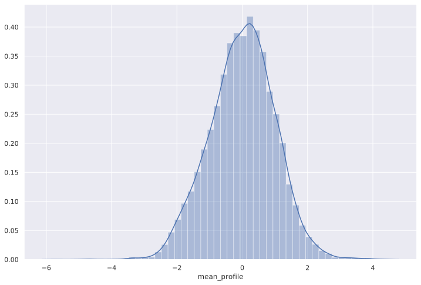

# Desafio 3

Neste desafio, iremos praticar nossos conhecimentos sobre distribuições de probabilidade. Para isso,
dividiremos este desafio em duas partes:
    
1. A primeira parte contará com 3 questões sobre um *data set* artificial com dados de uma amostra normal e
    uma binomial.
2. A segunda parte será sobre a análise da distribuição de uma variável do _data set_ [Pulsar Star](https://archive.ics.uci.edu/ml/datasets/HTRU2), contendo 2 questões.

> Obs.: Por favor, não modifique o nome das funções de resposta.

## _Setup_ geral


```python
import pandas as pd
import matplotlib.pyplot as plt
import numpy as np
import scipy.stats as sct
import seaborn as sns
from IPython import get_ipython
from statsmodels.distributions.empirical_distribution import ECDF
from IPython.core.pylabtools import figsize
```


```python
figsize(12, 8)

sns.set()
```

## Parte 1

### _Setup_ da parte 1


```python
np.random.seed(42)
    
dataframe = pd.DataFrame({"normal": sct.norm.rvs(20, 4, size=10000),
                     "binomial": sct.binom.rvs(100, 0.2, size=10000)})
```

## Inicie sua análise a partir da parte 1 a partir daqui


```python
# Sua análise da parte 1 começa aqui.
qt = dataframe.quantile((0.25, 0.5, 0.75))
tuple((qt['normal'] - qt['binomial']).round(3))

```


    (0.31, -0.01, -0.316)


## Questão 1

Qual a diferença entre os quartis (Q1, Q2 e Q3) das variáveis `normal` e `binomial` de `dataframe`? Responda como uma tupla de três elementos arredondados para três casas decimais.

Em outra palavras, sejam `q1_norm`, `q2_norm` e `q3_norm` os quantis da variável `normal` e `q1_binom`, `q2_binom` e `q3_binom` os quantis da variável `binom`, qual a diferença `(q1_norm - q1 binom, q2_norm - q2_binom, q3_norm - q3_binom)`?


```python
def q1():
    qt = dataframe.quantile((0.25, 0.5, 0.75))
    
    return tuple((qt['normal'] - qt['binomial']).round(3))
```

Para refletir:

* Você esperava valores dessa magnitude?

* Você é capaz de explicar como distribuições aparentemente tão diferentes (discreta e contínua, por exemplo) conseguem dar esses valores?

## Questão 2

Considere o intervalo $[\bar{x} - s, \bar{x} + s]$, onde $\bar{x}$ é a média amostral e $s$ é o desvio padrão. Qual a probabilidade nesse intervalo, calculada pela função de distribuição acumulada empírica (CDF empírica) da variável `normal`? Responda como uma único escalar arredondado para três casas decimais.


```python
def q2():
    ecdf = ECDF(dataframe['normal'])
    mean = dataframe['normal'].mean()
    std = dataframe['normal'].std()
    
    return float(ecdf(mean + std) - ecdf(mean - std))
```

Para refletir:

* Esse valor se aproxima do esperado teórico?
* Experimente também para os intervalos $[\bar{x} - 2s, \bar{x} + 2s]$ e $[\bar{x} - 3s, \bar{x} + 3s]$.


```python
def q2n(n):
    ecdf = ECDF(dataframe['normal'])
    mean = dataframe['normal'].mean()
    std = dataframe['normal'].std()
    
    return round(float(ecdf(mean + n*std) - ecdf(mean - n*std)), 4)


for i in range(0, 3):
    print(f'No intervalo de média +/- {i+ 1} x desvio padrão, espera-se que estejam {q2n(i + 1)*100}% dos dados')
```

    No intervalo de média +/- 1 x desvio padrão, espera-se que estejam 68.38% dos dados
    No intervalo de média +/- 2 x desvio padrão, espera-se que estejam 95.38% dos dados
    No intervalo de média +/- 3 x desvio padrão, espera-se que estejam 99.72999999999999% dos dados


## Questão 3

Qual é a diferença entre as médias e as variâncias das variáveis `binomial` e `normal`? Responda como uma tupla de dois elementos arredondados para três casas decimais.

Em outras palavras, sejam `m_binom` e `v_binom` a média e a variância da variável `binomial`, e `m_norm` e `v_norm` a média e a variância da variável `normal`. Quais as diferenças `(m_binom - m_norm, v_binom - v_norm)`?


```python
def q3():
    means = dataframe.mean()
    variances = dataframe.var()

    return (
        round(means['binomial'] - means['normal'], 3), 
        round(variances['binomial'] - variances['normal'], 3)
    )
```

    (0.106, 0.22)


Para refletir:

* Você esperava valores dessa magnitude?
 
- Reposta: Sim, pois o valor de amostra binomial é pequeno.

* Qual o efeito de aumentar ou diminuir $n$ (atualmente 100) na distribuição da variável `binomial`?

- Reposta: Aumentar o número de ocorrências de $n$ no modelo binomial faz com que a distribuição se aproxime cada vez mais do modelo normal, portanto, diminuindo as diferenças dos valores de média e variância entre os modelos e vice versa.

## Parte 2

### _Setup_ da parte 2


```python
stars = pd.read_csv("pulsar_stars.csv")

stars.rename({old_name: new_name
              for (old_name, new_name)
              in zip(stars.columns,
                     ["mean_profile", "sd_profile", "kurt_profile", "skew_profile", "mean_curve", "sd_curve", "kurt_curve", "skew_curve", "target"])
             },
             axis=1, inplace=True)

stars.loc[:, "target"] = stars.target.astype(bool)
```

## Inicie sua análise da parte 2 a partir daqui


```python
stars.describe()
```


<div>
<style scoped>
    .dataframe tbody tr th:only-of-type {
        vertical-align: middle;
    }

    .dataframe tbody tr th {
        vertical-align: top;
    }

    .dataframe thead th {
        text-align: right;
    }
</style>
<table border="1" class="dataframe">
  <thead>
    <tr style="text-align: right;">
      <th></th>
      <th>mean_profile</th>
      <th>sd_profile</th>
      <th>kurt_profile</th>
      <th>skew_profile</th>
      <th>mean_curve</th>
      <th>sd_curve</th>
      <th>kurt_curve</th>
      <th>skew_curve</th>
    </tr>
  </thead>
  <tbody>
    <tr>
      <th>count</th>
      <td>17897.000000</td>
      <td>17897.000000</td>
      <td>17897.000000</td>
      <td>17897.000000</td>
      <td>17897.000000</td>
      <td>17897.000000</td>
      <td>17897.000000</td>
      <td>17897.000000</td>
    </tr>
    <tr>
      <th>mean</th>
      <td>111.078321</td>
      <td>46.549021</td>
      <td>0.477897</td>
      <td>1.770417</td>
      <td>12.614926</td>
      <td>26.326918</td>
      <td>8.303574</td>
      <td>104.859419</td>
    </tr>
    <tr>
      <th>std</th>
      <td>25.652705</td>
      <td>6.843040</td>
      <td>1.064056</td>
      <td>6.168058</td>
      <td>29.473637</td>
      <td>19.471042</td>
      <td>4.506217</td>
      <td>106.517270</td>
    </tr>
    <tr>
      <th>min</th>
      <td>5.812500</td>
      <td>24.772042</td>
      <td>-1.876011</td>
      <td>-1.791886</td>
      <td>0.213211</td>
      <td>7.370432</td>
      <td>-3.139270</td>
      <td>-1.976976</td>
    </tr>
    <tr>
      <th>25%</th>
      <td>100.929688</td>
      <td>42.375426</td>
      <td>0.027108</td>
      <td>-0.188528</td>
      <td>1.923077</td>
      <td>14.437330</td>
      <td>5.781485</td>
      <td>34.957119</td>
    </tr>
    <tr>
      <th>50%</th>
      <td>115.078125</td>
      <td>46.946435</td>
      <td>0.223241</td>
      <td>0.198736</td>
      <td>2.801839</td>
      <td>18.459977</td>
      <td>8.433872</td>
      <td>83.068996</td>
    </tr>
    <tr>
      <th>75%</th>
      <td>127.085938</td>
      <td>51.022887</td>
      <td>0.473349</td>
      <td>0.928206</td>
      <td>5.464883</td>
      <td>28.428152</td>
      <td>10.702973</td>
      <td>139.310905</td>
    </tr>
    <tr>
      <th>max</th>
      <td>192.617188</td>
      <td>98.778911</td>
      <td>8.069522</td>
      <td>68.101622</td>
      <td>223.392140</td>
      <td>110.642211</td>
      <td>34.539844</td>
      <td>1191.000837</td>
    </tr>
  </tbody>
</table>
</div>


```python
stars.info()
```

    <class 'pandas.core.frame.DataFrame'>
    RangeIndex: 17897 entries, 0 to 17896
    Data columns (total 9 columns):
    mean_profile    17897 non-null float64
    sd_profile      17897 non-null float64
    kurt_profile    17897 non-null float64
    skew_profile    17897 non-null float64
    mean_curve      17897 non-null float64
    sd_curve        17897 non-null float64
    kurt_curve      17897 non-null float64
    skew_curve      17897 non-null float64
    target          17897 non-null bool
    dtypes: bool(1), float64(8)
    memory usage: 1.1 MB


## Questão 4

Considerando a variável `mean_profile` de `stars`:

1. Filtre apenas os valores de `mean_profile` onde `target == 0` (ou seja, onde a estrela não é um pulsar).
2. Padronize a variável `mean_profile` filtrada anteriormente para ter média 0 e variância 1.

Chamaremos a variável resultante de `false_pulsar_mean_profile_standardized`.

Encontre os quantis teóricos para uma distribuição normal de média 0 e variância 1 para 0.80, 0.90 e 0.95 através da função `norm.ppf()` disponível em `scipy.stats`.

Quais as probabilidade associadas a esses quantis utilizando a CDF empírica da variável `false_pulsar_mean_profile_standardized`? Responda como uma tupla de três elementos arredondados para três casas decimais.


```python
    non_pulsar = stars[stars['target'] == 0]['mean_profile']
    std_non_pulsar = (non_pulsar - non_pulsar.mean()) / non_pulsar.std()
    # print(std_non_pulsar.mean(), std_non_pulsar.var())
```


```python
def q4():
    non_pulsar = stars[stars['target'] == 0]['mean_profile']
    std_non_pulsar = (non_pulsar - non_pulsar.mean()) / non_pulsar.std()
    ecdf = ECDF(std_non_pulsar)
    q80 = sct.norm.ppf(0.8, loc = 0, scale = 1)
    q90 = sct.norm.ppf(0.9, loc = 0, scale = 1)
    q95 = sct.norm.ppf(0.95, loc = 0, scale = 1)

    return (
        ecdf(q80).round(3), 
        ecdf(q90).round(3), 
        ecdf(q95).round(3)
    )
```

    (0.806, 0.911, 0.959)


Para refletir:

* Os valores encontrados fazem sentido?
* O que isso pode dizer sobre a distribuição da variável `false_pulsar_mean_profile_standardized`?


```python
sns.distplot(std_non_pulsar);
```





- Resposta: A distribuição falsa é bastante próxima da distribuição normal, portanto os valores fazem sentido

## Questão 5

Qual a diferença entre os quantis Q1, Q2 e Q3 de `false_pulsar_mean_profile_standardized` e os mesmos quantis teóricos de uma distribuição normal de média 0 e variância 1? Responda como uma tupla de três elementos arredondados para três casas decimais.


```python
def q5():
    non_pulsar = stars[stars['target'] == 0]['mean_profile']
    std_non_pulsar = (non_pulsar - non_pulsar.mean()) / non_pulsar.std()
    non_pulsar_qt = std_non_pulsar.quantile((0.25, 0.5, 0.75))
    normal_qt = sct.norm.ppf((0.25, 0.5, 0.75), loc = 0, scale = 1)
    non_pulsar_qt = np.array(non_pulsar_qt.tolist())

    return tuple(np.around(non_pulsar_qt - normal_qt, decimals = 3))
```

    (0.027, 0.04, -0.004)


Para refletir:

* Os valores encontrados fazem sentido?
* O que isso pode dizer sobre a distribuição da variável `false_pulsar_mean_profile_standardized`?

- Resposta: Demonstra que a distribuição Falsa é muito próxima da distribuição Normal
<br><br>
* Curiosidade: alguns testes de hipóteses sobre normalidade dos dados utilizam essa mesma abordagem.
