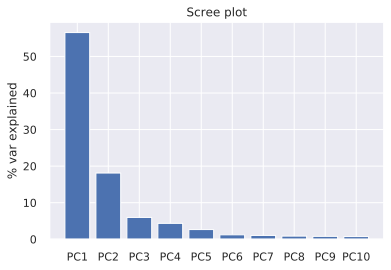
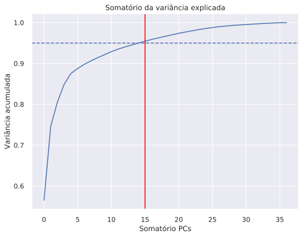
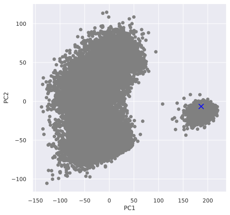

# Desafio 5

Neste desafio, vamos praticar sobre redução de dimensionalidade com PCA e seleção de variáveis com RFE. Utilizaremos o _data set_ [Fifa 2019](https://www.kaggle.com/karangadiya/fifa19), contendo originalmente 89 variáveis de mais de 18 mil jogadores do _game_ FIFA 2019.

> Obs.: Por favor, não modifique o nome das funções de resposta.

## _Setup_ geral


```python
from math import sqrt
import pandas as pd
import matplotlib.pyplot as plt
import numpy as np
import scipy.stats as sct
import seaborn as sns
import statsmodels.api as sm
import statsmodels.stats as st
from sklearn.linear_model import LinearRegression
from sklearn.decomposition import PCA
from sklearn.feature_selection import RFE
from loguru import logger
from IPython import get_ipython
from IPython.core.pylabtools import figsize
from yellowbrick.features import PCA as yPCA


figsize(12, 8)
sns.set()
```


```python
fifa = pd.read_csv("fifa.csv")
```


```python
columns_to_drop = ["Unnamed: 0", "ID", "Name", "Photo", "Nationality", "Flag",
                   "Club", "Club Logo", "Value", "Wage", "Special", "Preferred Foot",
                   "International Reputation", "Weak Foot", "Skill Moves", "Work Rate",
                   "Body Type", "Real Face", "Position", "Jersey Number", "Joined",
                   "Loaned From", "Contract Valid Until", "Height", "Weight", "LS",
                   "ST", "RS", "LW", "LF", "CF", "RF", "RW", "LAM", "CAM", "RAM", "LM",
                   "LCM", "CM", "RCM", "RM", "LWB", "LDM", "CDM", "RDM", "RWB", "LB", "LCB",
                   "CB", "RCB", "RB", "Release Clause"
]

try:
    fifa.drop(columns_to_drop, axis=1, inplace=True)
except KeyError:
    logger.warning(f"Columns already dropped")
```

## Inicia sua análise a partir daqui


```python
fifa.describe()
```


<div>
<style scoped>
    .dataframe tbody tr th:only-of-type {
        vertical-align: middle;
    }

    .dataframe tbody tr th {
        vertical-align: top;
    }

    .dataframe thead th {
        text-align: right;
    }
</style>
<table border="1" class="dataframe">
  <thead>
    <tr style="text-align: right;">
      <th></th>
      <th>Age</th>
      <th>Overall</th>
      <th>Potential</th>
      <th>Crossing</th>
      <th>Finishing</th>
      <th>HeadingAccuracy</th>
      <th>ShortPassing</th>
      <th>Volleys</th>
      <th>Dribbling</th>
      <th>Curve</th>
      <th>...</th>
      <th>Penalties</th>
      <th>Composure</th>
      <th>Marking</th>
      <th>StandingTackle</th>
      <th>SlidingTackle</th>
      <th>GKDiving</th>
      <th>GKHandling</th>
      <th>GKKicking</th>
      <th>GKPositioning</th>
      <th>GKReflexes</th>
    </tr>
  </thead>
  <tbody>
    <tr>
      <th>count</th>
      <td>18207.000000</td>
      <td>18207.000000</td>
      <td>18207.000000</td>
      <td>18159.000000</td>
      <td>18159.000000</td>
      <td>18159.000000</td>
      <td>18159.000000</td>
      <td>18159.000000</td>
      <td>18159.000000</td>
      <td>18159.000000</td>
      <td>...</td>
      <td>18159.000000</td>
      <td>18159.000000</td>
      <td>18159.000000</td>
      <td>18159.000000</td>
      <td>18159.000000</td>
      <td>18159.000000</td>
      <td>18159.000000</td>
      <td>18159.000000</td>
      <td>18159.000000</td>
      <td>18159.000000</td>
    </tr>
    <tr>
      <th>mean</th>
      <td>25.122206</td>
      <td>66.238699</td>
      <td>71.307299</td>
      <td>49.734181</td>
      <td>45.550911</td>
      <td>52.298144</td>
      <td>58.686712</td>
      <td>42.909026</td>
      <td>55.371001</td>
      <td>47.170824</td>
      <td>...</td>
      <td>48.548598</td>
      <td>58.648274</td>
      <td>47.281623</td>
      <td>47.697836</td>
      <td>45.661435</td>
      <td>16.616223</td>
      <td>16.391596</td>
      <td>16.232061</td>
      <td>16.388898</td>
      <td>16.710887</td>
    </tr>
    <tr>
      <th>std</th>
      <td>4.669943</td>
      <td>6.908930</td>
      <td>6.136496</td>
      <td>18.364524</td>
      <td>19.525820</td>
      <td>17.379909</td>
      <td>14.699495</td>
      <td>17.694408</td>
      <td>18.910371</td>
      <td>18.395264</td>
      <td>...</td>
      <td>15.704053</td>
      <td>11.436133</td>
      <td>19.904397</td>
      <td>21.664004</td>
      <td>21.289135</td>
      <td>17.695349</td>
      <td>16.906900</td>
      <td>16.502864</td>
      <td>17.034669</td>
      <td>17.955119</td>
    </tr>
    <tr>
      <th>min</th>
      <td>16.000000</td>
      <td>46.000000</td>
      <td>48.000000</td>
      <td>5.000000</td>
      <td>2.000000</td>
      <td>4.000000</td>
      <td>7.000000</td>
      <td>4.000000</td>
      <td>4.000000</td>
      <td>6.000000</td>
      <td>...</td>
      <td>5.000000</td>
      <td>3.000000</td>
      <td>3.000000</td>
      <td>2.000000</td>
      <td>3.000000</td>
      <td>1.000000</td>
      <td>1.000000</td>
      <td>1.000000</td>
      <td>1.000000</td>
      <td>1.000000</td>
    </tr>
    <tr>
      <th>25%</th>
      <td>21.000000</td>
      <td>62.000000</td>
      <td>67.000000</td>
      <td>38.000000</td>
      <td>30.000000</td>
      <td>44.000000</td>
      <td>54.000000</td>
      <td>30.000000</td>
      <td>49.000000</td>
      <td>34.000000</td>
      <td>...</td>
      <td>39.000000</td>
      <td>51.000000</td>
      <td>30.000000</td>
      <td>27.000000</td>
      <td>24.000000</td>
      <td>8.000000</td>
      <td>8.000000</td>
      <td>8.000000</td>
      <td>8.000000</td>
      <td>8.000000</td>
    </tr>
    <tr>
      <th>50%</th>
      <td>25.000000</td>
      <td>66.000000</td>
      <td>71.000000</td>
      <td>54.000000</td>
      <td>49.000000</td>
      <td>56.000000</td>
      <td>62.000000</td>
      <td>44.000000</td>
      <td>61.000000</td>
      <td>48.000000</td>
      <td>...</td>
      <td>49.000000</td>
      <td>60.000000</td>
      <td>53.000000</td>
      <td>55.000000</td>
      <td>52.000000</td>
      <td>11.000000</td>
      <td>11.000000</td>
      <td>11.000000</td>
      <td>11.000000</td>
      <td>11.000000</td>
    </tr>
    <tr>
      <th>75%</th>
      <td>28.000000</td>
      <td>71.000000</td>
      <td>75.000000</td>
      <td>64.000000</td>
      <td>62.000000</td>
      <td>64.000000</td>
      <td>68.000000</td>
      <td>57.000000</td>
      <td>68.000000</td>
      <td>62.000000</td>
      <td>...</td>
      <td>60.000000</td>
      <td>67.000000</td>
      <td>64.000000</td>
      <td>66.000000</td>
      <td>64.000000</td>
      <td>14.000000</td>
      <td>14.000000</td>
      <td>14.000000</td>
      <td>14.000000</td>
      <td>14.000000</td>
    </tr>
    <tr>
      <th>max</th>
      <td>45.000000</td>
      <td>94.000000</td>
      <td>95.000000</td>
      <td>93.000000</td>
      <td>95.000000</td>
      <td>94.000000</td>
      <td>93.000000</td>
      <td>90.000000</td>
      <td>97.000000</td>
      <td>94.000000</td>
      <td>...</td>
      <td>92.000000</td>
      <td>96.000000</td>
      <td>94.000000</td>
      <td>93.000000</td>
      <td>91.000000</td>
      <td>90.000000</td>
      <td>92.000000</td>
      <td>91.000000</td>
      <td>90.000000</td>
      <td>94.000000</td>
    </tr>
  </tbody>
</table>
<p>8 rows × 37 columns</p>
</div>


```python
# Tabela auxiliar
cons = pd.DataFrame({
    'type': fifa.dtypes,
    'NA_sum': fifa.isna().sum(),
    'missing': fifa.isna().sum() / fifa.shape[0],
    'unique': fifa.nunique()
})

cons.sort_values(by = 'missing', ascending = False).head(10)
```


<div>
<style scoped>
    .dataframe tbody tr th:only-of-type {
        vertical-align: middle;
    }

    .dataframe tbody tr th {
        vertical-align: top;
    }

    .dataframe thead th {
        text-align: right;
    }
</style>
<table border="1" class="dataframe">
  <thead>
    <tr style="text-align: right;">
      <th></th>
      <th>type</th>
      <th>NA_sum</th>
      <th>missing</th>
      <th>unique</th>
    </tr>
  </thead>
  <tbody>
    <tr>
      <th>ShotPower</th>
      <td>float64</td>
      <td>48</td>
      <td>0.002636</td>
      <td>92</td>
    </tr>
    <tr>
      <th>Jumping</th>
      <td>float64</td>
      <td>48</td>
      <td>0.002636</td>
      <td>74</td>
    </tr>
    <tr>
      <th>Strength</th>
      <td>float64</td>
      <td>48</td>
      <td>0.002636</td>
      <td>74</td>
    </tr>
    <tr>
      <th>LongShots</th>
      <td>float64</td>
      <td>48</td>
      <td>0.002636</td>
      <td>92</td>
    </tr>
    <tr>
      <th>Aggression</th>
      <td>float64</td>
      <td>48</td>
      <td>0.002636</td>
      <td>85</td>
    </tr>
    <tr>
      <th>Interceptions</th>
      <td>float64</td>
      <td>48</td>
      <td>0.002636</td>
      <td>89</td>
    </tr>
    <tr>
      <th>Positioning</th>
      <td>float64</td>
      <td>48</td>
      <td>0.002636</td>
      <td>94</td>
    </tr>
    <tr>
      <th>Vision</th>
      <td>float64</td>
      <td>48</td>
      <td>0.002636</td>
      <td>85</td>
    </tr>
    <tr>
      <th>Penalties</th>
      <td>float64</td>
      <td>48</td>
      <td>0.002636</td>
      <td>87</td>
    </tr>
    <tr>
      <th>Composure</th>
      <td>float64</td>
      <td>48</td>
      <td>0.002636</td>
      <td>84</td>
    </tr>
  </tbody>
</table>
</div>


```python
# Imputando média nos valores faltantes
df = fifa.copy()
missing_names = list(cons[cons['NA_sum'] != 0].index)
df[missing_names] = df[missing_names].fillna(df[missing_names].mean())
pca_df = PCA().fit(df)
evr_df = pca_df.explained_variance_ratio_

# Comparando com remover NAs de FIFA
fifa.dropna(inplace = True)
pca = PCA().fit(fifa)
evr = pca.explained_variance_ratio_

# Criando índices
labels = [f'PC{i}' for i in range(1, len(evr) + 1)]
PC_table = pd.DataFrame({'evr_imputed_mean': evr_df, 'evr_drop_na': evr}, index = labels)
PC_table.head(10)
```


<div>
<style scoped>
    .dataframe tbody tr th:only-of-type {
        vertical-align: middle;
    }

    .dataframe tbody tr th {
        vertical-align: top;
    }

    .dataframe thead th {
        text-align: right;
    }
</style>
<table border="1" class="dataframe">
  <thead>
    <tr style="text-align: right;">
      <th></th>
      <th>evr_imputed_mean</th>
      <th>evr_drop_na</th>
    </tr>
  </thead>
  <tbody>
    <tr>
      <th>PC1</th>
      <td>0.565268</td>
      <td>0.565281</td>
    </tr>
    <tr>
      <th>PC2</th>
      <td>0.181021</td>
      <td>0.181025</td>
    </tr>
    <tr>
      <th>PC3</th>
      <td>0.059527</td>
      <td>0.059528</td>
    </tr>
    <tr>
      <th>PC4</th>
      <td>0.043426</td>
      <td>0.043427</td>
    </tr>
    <tr>
      <th>PC5</th>
      <td>0.026353</td>
      <td>0.026353</td>
    </tr>
    <tr>
      <th>PC6</th>
      <td>0.012071</td>
      <td>0.012071</td>
    </tr>
    <tr>
      <th>PC7</th>
      <td>0.010355</td>
      <td>0.010355</td>
    </tr>
    <tr>
      <th>PC8</th>
      <td>0.008530</td>
      <td>0.008530</td>
    </tr>
    <tr>
      <th>PC9</th>
      <td>0.007879</td>
      <td>0.007879</td>
    </tr>
    <tr>
      <th>PC10</th>
      <td>0.007204</td>
      <td>0.007204</td>
    </tr>
  </tbody>
</table>
</div>


```python
# Criando Scree Plot
top_10_labels = list(PC_table.index)[0:10]

plt.bar(top_10_labels, PC_table.evr_drop_na.head(10) * 100 )
plt.title("Scree plot")
plt.ylabel("% var explained");
```





```python
evr[0]
```


    0.565280555000852


## Questão 1

Qual fração da variância consegue ser explicada pelo primeiro componente principal de `fifa`? Responda como um único float (entre 0 e 1) arredondado para três casas decimais.


```python
def q1():
    fifa.dropna(inplace = True)
    pca = PCA().fit(fifa)
    evr = pca.explained_variance_ratio_

    return round(float(evr[0]), 3)
```

## Questão 2

Quantos componentes principais precisamos para explicar 95% da variância total? Responda como un único escalar inteiro.


```python
fifa.dropna(inplace = True)
pca = PCA().fit(fifa)
evr = pca.explained_variance_ratio_
# Obtendo vetores soma e índice de PCs
cumsum = np.cumsum(evr)
PC_ID = list(range(len(cumsum)))

pca95 = PCA(0.95).fit(fifa)
evr95 = pca95.explained_variance_ratio_

plt.figure(figsize = (8, 6))
sns.lineplot(PC_ID, cumsum).\
    axes.axhline(0.95, ls = "--").\
    axes.axvline(len(evr95), color = "red")
plt.xlabel("Somatório PCs")
plt.ylabel("Variância acumulada")
plt.title("Somatório da variância explicada");
```





```python
def q2():
    fifa.dropna(inplace = True)
    pca = PCA(0.95).fit(fifa)

    return len(pca.explained_variance_ratio_)
```

## Questão 3

Qual são as coordenadas (primeiro e segundo componentes principais) do ponto `x` abaixo? O vetor abaixo já está centralizado. Cuidado para __não__ centralizar o vetor novamente (por exemplo, invocando `PCA.transform()` nele). Responda como uma tupla de float arredondados para três casas decimais.


```python
x = [0.87747123,  -1.24990363,  -1.3191255, -36.7341814,
     -35.55091139, -37.29814417, -28.68671182, -30.90902583,
     -42.37100061, -32.17082438, -28.86315326, -22.71193348,
     -38.36945867, -20.61407566, -22.72696734, -25.50360703,
     2.16339005, -27.96657305, -33.46004736,  -5.08943224,
     -30.21994603,   3.68803348, -36.10997302, -30.86899058,
     -22.69827634, -37.95847789, -22.40090313, -30.54859849,
     -26.64827358, -19.28162344, -34.69783578, -34.6614351,
     48.38377664,  47.60840355,  45.76793876,  44.61110193,
     49.28911284
]
```


```python
# Selecionando 2 PC
pca = PCA(2).fit(fifa)
# Obtendo matriz de coordenadas dos componentes
pca_coord = pca.transform(fifa)
# Obter centro
components = pca.components_
center = list(components.dot(x))

plt.figure(figsize = (7, 7))
plt.scatter(pca_coord[:, 0], pca_coord[:, 1], c = 'gray')
plt.scatter(center[0], center[1], c = 'blue', marker = "x", s = 100)
plt.xlabel("PC1")
plt.ylabel("PC2");
```





```python
def q3():
    pca = PCA(2).fit(fifa)
    components = pca.components_
    center = components.dot(x)

    return tuple(center.round(3))
```

## Questão 4

Realiza RFE com estimador de regressão linear para selecionar cinco variáveis, eliminando uma a uma. Quais são as variáveis selecionadas? Responda como uma lista de nomes de variáveis.


```python
X = fifa.drop(columns = 'Overall')
y = fifa['Overall']

plt.figure(figsize = (10, 6))
yPCA(scale = True, proj_features = True, projection = 2, colormap = 'hot_r', colorbar = True, heatmap = True).fit_transform(X, y);
```


```python
lm = LinearRegression()
rfe = RFE(lm, n_features_to_select = 5)
rfe.fit(X, y)

select = pd.DataFrame({'bool':rfe.get_support()}, index = X.columns)
select[select['bool'] == True].index.tolist()
```


    ['Age', 'Potential', 'BallControl', 'Reactions', 'GKReflexes']


```python
def q4():
    X = fifa.drop(columns = 'Overall')
    y = fifa['Overall']

    lm = LinearRegression()
    rfe = RFE(lm, n_features_to_select = 5)
    rfe.fit(X, y)

    return list(X.columns[rfe.support_])

```
