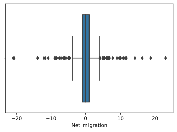

# Desafio 6

Neste desafio, vamos praticar _feature engineering_, um dos processos mais importantes e trabalhosos de ML. Utilizaremos o _data set_ [Countries of the world](https://www.kaggle.com/fernandol/countries-of-the-world), que contém dados sobre os 227 países do mundo com informações sobre tamanho da população, área, imigração e setores de produção.

> Obs.: Por favor, não modifique o nome das funções de resposta.

## _Setup_ geral


```python
import pandas as pd
import numpy as np
import seaborn as sns
import sklearn as sk
from IPython import get_ipython
from sklearn.impute import SimpleImputer
from sklearn.pipeline import Pipeline
from sklearn.feature_extraction.text import (
    CountVectorizer, TfidfTransformer, TfidfVectorizer
)
from sklearn.datasets import fetch_20newsgroups
from sklearn.preprocessing import (
    KBinsDiscretizer, StandardScaler, OneHotEncoder, 
)
from IPython.core.pylabtools import figsize

# figsize(12, 8)
# sns.set()
```


```python
countries = pd.read_csv("countries.csv", decimal=",", encoding="utf-8")

new_column_names = [
    "Country", "Region", "Population", "Area", "Pop_density", "Coastline_ratio",
    "Net_migration", "Infant_mortality", "GDP", "Literacy", "Phones_per_1000",
    "Arable", "Crops", "Other", "Climate", "Birthrate", "Deathrate", "Agriculture",
    "Industry", "Service"
]

countries.columns = new_column_names

countries.head(5)
```


<div>
<style scoped>
    .dataframe tbody tr th:only-of-type {
        vertical-align: middle;
    }

    .dataframe tbody tr th {
        vertical-align: top;
    }

    .dataframe thead th {
        text-align: right;
    }
</style>
<table border="1" class="dataframe">
  <thead>
    <tr style="text-align: right;">
      <th></th>
      <th>Country</th>
      <th>Region</th>
      <th>Population</th>
      <th>Area</th>
      <th>Pop_density</th>
      <th>Coastline_ratio</th>
      <th>Net_migration</th>
      <th>Infant_mortality</th>
      <th>GDP</th>
      <th>Literacy</th>
      <th>Phones_per_1000</th>
      <th>Arable</th>
      <th>Crops</th>
      <th>Other</th>
      <th>Climate</th>
      <th>Birthrate</th>
      <th>Deathrate</th>
      <th>Agriculture</th>
      <th>Industry</th>
      <th>Service</th>
    </tr>
  </thead>
  <tbody>
    <tr>
      <th>0</th>
      <td>Afghanistan</td>
      <td>ASIA (EX. NEAR EAST)</td>
      <td>31056997</td>
      <td>647500</td>
      <td>48.0</td>
      <td>0.00</td>
      <td>23.06</td>
      <td>163.07</td>
      <td>700.0</td>
      <td>36.0</td>
      <td>3.2</td>
      <td>12.13</td>
      <td>0.22</td>
      <td>87.65</td>
      <td>1.0</td>
      <td>46.60</td>
      <td>20.34</td>
      <td>0.380</td>
      <td>0.240</td>
      <td>0.380</td>
    </tr>
    <tr>
      <th>1</th>
      <td>Albania</td>
      <td>EASTERN EUROPE</td>
      <td>3581655</td>
      <td>28748</td>
      <td>124.6</td>
      <td>1.26</td>
      <td>-4.93</td>
      <td>21.52</td>
      <td>4500.0</td>
      <td>86.5</td>
      <td>71.2</td>
      <td>21.09</td>
      <td>4.42</td>
      <td>74.49</td>
      <td>3.0</td>
      <td>15.11</td>
      <td>5.22</td>
      <td>0.232</td>
      <td>0.188</td>
      <td>0.579</td>
    </tr>
    <tr>
      <th>2</th>
      <td>Algeria</td>
      <td>NORTHERN AFRICA</td>
      <td>32930091</td>
      <td>2381740</td>
      <td>13.8</td>
      <td>0.04</td>
      <td>-0.39</td>
      <td>31.00</td>
      <td>6000.0</td>
      <td>70.0</td>
      <td>78.1</td>
      <td>3.22</td>
      <td>0.25</td>
      <td>96.53</td>
      <td>1.0</td>
      <td>17.14</td>
      <td>4.61</td>
      <td>0.101</td>
      <td>0.600</td>
      <td>0.298</td>
    </tr>
    <tr>
      <th>3</th>
      <td>American Samoa</td>
      <td>OCEANIA</td>
      <td>57794</td>
      <td>199</td>
      <td>290.4</td>
      <td>58.29</td>
      <td>-20.71</td>
      <td>9.27</td>
      <td>8000.0</td>
      <td>97.0</td>
      <td>259.5</td>
      <td>10.00</td>
      <td>15.00</td>
      <td>75.00</td>
      <td>2.0</td>
      <td>22.46</td>
      <td>3.27</td>
      <td>NaN</td>
      <td>NaN</td>
      <td>NaN</td>
    </tr>
    <tr>
      <th>4</th>
      <td>Andorra</td>
      <td>WESTERN EUROPE</td>
      <td>71201</td>
      <td>468</td>
      <td>152.1</td>
      <td>0.00</td>
      <td>6.60</td>
      <td>4.05</td>
      <td>19000.0</td>
      <td>100.0</td>
      <td>497.2</td>
      <td>2.22</td>
      <td>0.00</td>
      <td>97.78</td>
      <td>3.0</td>
      <td>8.71</td>
      <td>6.25</td>
      <td>NaN</td>
      <td>NaN</td>
      <td>NaN</td>
    </tr>
  </tbody>
</table>
</div>


```python
countries["Country"] = countries["Country"].str.rstrip().str.lstrip()
countries["Region"] = countries["Region"].str.rstrip().str.lstrip()
countries.to_csv('fit_countries.csv', sep=',', encoding='utf-8', decimal='.', index=False)
```


```python
countries = pd.read_csv('fit_countries.csv')
countries.head()
```


<div>
<style scoped>
    .dataframe tbody tr th:only-of-type {
        vertical-align: middle;
    }

    .dataframe tbody tr th {
        vertical-align: top;
    }

    .dataframe thead th {
        text-align: right;
    }
</style>
<table border="1" class="dataframe">
  <thead>
    <tr style="text-align: right;">
      <th></th>
      <th>Country</th>
      <th>Region</th>
      <th>Population</th>
      <th>Area</th>
      <th>Pop_density</th>
      <th>Coastline_ratio</th>
      <th>Net_migration</th>
      <th>Infant_mortality</th>
      <th>GDP</th>
      <th>Literacy</th>
      <th>Phones_per_1000</th>
      <th>Arable</th>
      <th>Crops</th>
      <th>Other</th>
      <th>Climate</th>
      <th>Birthrate</th>
      <th>Deathrate</th>
      <th>Agriculture</th>
      <th>Industry</th>
      <th>Service</th>
    </tr>
  </thead>
  <tbody>
    <tr>
      <th>0</th>
      <td>Afghanistan</td>
      <td>ASIA (EX. NEAR EAST)</td>
      <td>31056997</td>
      <td>647500</td>
      <td>48.0</td>
      <td>0.00</td>
      <td>23.06</td>
      <td>163.07</td>
      <td>700.0</td>
      <td>36.0</td>
      <td>3.2</td>
      <td>12.13</td>
      <td>0.22</td>
      <td>87.65</td>
      <td>1.0</td>
      <td>46.60</td>
      <td>20.34</td>
      <td>0.380</td>
      <td>0.240</td>
      <td>0.380</td>
    </tr>
    <tr>
      <th>1</th>
      <td>Albania</td>
      <td>EASTERN EUROPE</td>
      <td>3581655</td>
      <td>28748</td>
      <td>124.6</td>
      <td>1.26</td>
      <td>-4.93</td>
      <td>21.52</td>
      <td>4500.0</td>
      <td>86.5</td>
      <td>71.2</td>
      <td>21.09</td>
      <td>4.42</td>
      <td>74.49</td>
      <td>3.0</td>
      <td>15.11</td>
      <td>5.22</td>
      <td>0.232</td>
      <td>0.188</td>
      <td>0.579</td>
    </tr>
    <tr>
      <th>2</th>
      <td>Algeria</td>
      <td>NORTHERN AFRICA</td>
      <td>32930091</td>
      <td>2381740</td>
      <td>13.8</td>
      <td>0.04</td>
      <td>-0.39</td>
      <td>31.00</td>
      <td>6000.0</td>
      <td>70.0</td>
      <td>78.1</td>
      <td>3.22</td>
      <td>0.25</td>
      <td>96.53</td>
      <td>1.0</td>
      <td>17.14</td>
      <td>4.61</td>
      <td>0.101</td>
      <td>0.600</td>
      <td>0.298</td>
    </tr>
    <tr>
      <th>3</th>
      <td>American Samoa</td>
      <td>OCEANIA</td>
      <td>57794</td>
      <td>199</td>
      <td>290.4</td>
      <td>58.29</td>
      <td>-20.71</td>
      <td>9.27</td>
      <td>8000.0</td>
      <td>97.0</td>
      <td>259.5</td>
      <td>10.00</td>
      <td>15.00</td>
      <td>75.00</td>
      <td>2.0</td>
      <td>22.46</td>
      <td>3.27</td>
      <td>NaN</td>
      <td>NaN</td>
      <td>NaN</td>
    </tr>
    <tr>
      <th>4</th>
      <td>Andorra</td>
      <td>WESTERN EUROPE</td>
      <td>71201</td>
      <td>468</td>
      <td>152.1</td>
      <td>0.00</td>
      <td>6.60</td>
      <td>4.05</td>
      <td>19000.0</td>
      <td>100.0</td>
      <td>497.2</td>
      <td>2.22</td>
      <td>0.00</td>
      <td>97.78</td>
      <td>3.0</td>
      <td>8.71</td>
      <td>6.25</td>
      <td>NaN</td>
      <td>NaN</td>
      <td>NaN</td>
    </tr>
  </tbody>
</table>
</div>


## Observações

Esse _data set_ ainda precisa de alguns ajustes iniciais. Primeiro, note que as variáveis numéricas estão usando vírgula como separador decimal e estão codificadas como strings. Corrija isso antes de continuar: transforme essas variáveis em numéricas adequadamente.

Além disso, as variáveis `Country` e `Region` possuem espaços a mais no começo e no final da string. Você pode utilizar o método `str.strip()` para remover esses espaços.

## Inicia sua análise a partir daqui

## Questão 1

Quais são as regiões (variável `Region`) presentes no _data set_? Retorne uma lista com as regiões únicas do _data set_ com os espaços à frente e atrás da string removidos (mas mantenha pontuação: ponto, hífen etc) e ordenadas em ordem alfabética.


```python
def q1():
   
   return sorted(countries["Region"].unique().tolist())

q1()
```

## Questão 2

Discretizando a variável `Pop_density` em 10 intervalos com `KBinsDiscretizer`, seguindo o encode `ordinal` e estratégia `quantile`, quantos países se encontram acima do 90º percentil? Responda como um único escalar inteiro.


```python
countries["Pop_density"].head()
```


    0     48.0
    1    124.6
    2     13.8
    3    290.4
    4    152.1
    Name: Pop_density, dtype: float64


```python
discretizer = KBinsDiscretizer(n_bins = 10, strategy = 'quantile', encode = 'ordinal')
score_bins = discretizer.fit_transform(countries[["Pop_density"]])

```


```python
def get_interval(bin_idx, bin_edges):

  return f"{np.round(bin_edges[bin_idx], 2):.2f} ⊢ {np.round(bin_edges[bin_idx+1], 2):.2f}"


bin_edges_quantile = discretizer.bin_edges_[0]

print(f"Bins quantile")
print(f"interval: #elements\n")
for i in range(len(discretizer.bin_edges_[0])-1):
    print(f"{get_interval(i, bin_edges_quantile)}: {sum(score_bins[:, 0] == i)}")
```

    Bins quantile
    interval: #elements
    
    0.00 ⊢ 10.14: 23
    10.14 ⊢ 21.22: 23
    21.22 ⊢ 39.48: 22
    39.48 ⊢ 59.80: 23
    59.80 ⊢ 78.80: 22
    78.80 ⊢ 105.54: 23
    105.54 ⊢ 150.12: 23
    150.12 ⊢ 253.70: 22
    253.70 ⊢ 396.74: 23
    396.74 ⊢ 16271.50: 23


```python
def q2():
    discretizer = KBinsDiscretizer(n_bins = 10, strategy = 'quantile', encode = 'ordinal')
    score_bins = discretizer.fit_transform(countries[["Pop_density"]])
    # Quantil 1 == elemento 0, quantil 10 == elemento 9

    return int(sum(score_bins.flatten() > 8))


q2()
```


    23


# Questão 3

Se codificarmos as variáveis `Region` e `Climate` usando _one-hot encoding_, quantos novos atributos seriam criados? Responda como um único escalar.


```python
def q3():
    onehotencoder = OneHotEncoder(dtype='object')
    new_region = countries[['Region', 'Climate']].fillna(0)
    encoded = onehotencoder.fit_transform(new_region[['Region', 'Climate']])
    
    return encoded.shape[1]


q3()
```


    18


## Questão 4

Aplique o seguinte _pipeline_:

1. Preencha as variáveis do tipo `int64` e `float64` com suas respectivas medianas.
2. Padronize essas variáveis.

Após aplicado o _pipeline_ descrito acima aos dados (somente nas variáveis dos tipos especificados), aplique o mesmo _pipeline_ (ou `ColumnTransformer`) ao dado abaixo. Qual o valor da variável `Arable` após o _pipeline_? Responda como um único float arredondado para três casas decimais.


```python
test_country = [
    'Test Country', 'NEAR EAST', -0.19032480757326514,
    -0.3232636124824411, -0.04421734470810142, -0.27528113360605316,
    0.13255850810281325, -0.8054845935643491, 1.0119784924248225,
    0.6189182532646624, 1.0074863283776458, 0.20239896852403538,
    -0.043678728558593366, -0.13929748680369286, 1.3163604645710438,
    -0.3699637766938669, -0.6149300604558857, -0.854369594993175,
    0.263445277972641, 0.5712416961268142
]
```


```python
test_country_df = pd.DataFrame(data=[test_country], columns = countries.columns)
test_country_df
```


<div>
<style scoped>
    .dataframe tbody tr th:only-of-type {
        vertical-align: middle;
    }

    .dataframe tbody tr th {
        vertical-align: top;
    }

    .dataframe thead th {
        text-align: right;
    }
</style>
<table border="1" class="dataframe">
  <thead>
    <tr style="text-align: right;">
      <th></th>
      <th>Country</th>
      <th>Region</th>
      <th>Population</th>
      <th>Area</th>
      <th>Pop_density</th>
      <th>Coastline_ratio</th>
      <th>Net_migration</th>
      <th>Infant_mortality</th>
      <th>GDP</th>
      <th>Literacy</th>
      <th>Phones_per_1000</th>
      <th>Arable</th>
      <th>Crops</th>
      <th>Other</th>
      <th>Climate</th>
      <th>Birthrate</th>
      <th>Deathrate</th>
      <th>Agriculture</th>
      <th>Industry</th>
      <th>Service</th>
    </tr>
  </thead>
  <tbody>
    <tr>
      <th>0</th>
      <td>Test Country</td>
      <td>NEAR EAST</td>
      <td>-0.190325</td>
      <td>-0.323264</td>
      <td>-0.044217</td>
      <td>-0.275281</td>
      <td>0.132559</td>
      <td>-0.805485</td>
      <td>1.011978</td>
      <td>0.618918</td>
      <td>1.007486</td>
      <td>0.202399</td>
      <td>-0.043679</td>
      <td>-0.139297</td>
      <td>1.31636</td>
      <td>-0.369964</td>
      <td>-0.61493</td>
      <td>-0.85437</td>
      <td>0.263445</td>
      <td>0.571242</td>
    </tr>
  </tbody>
</table>
</div>


```python
num_pipeline = Pipeline([
    ("imputer", SimpleImputer(strategy="median")),
    ("scaler", StandardScaler())
])

num_pipeline.fit_transform(countries._get_numeric_data())
```


    array([[ 0.01969468,  0.02758332, -0.19984434, ...,  1.63657562,
            -0.31540576, -1.1611354 ],
           [-0.21387688, -0.31879748, -0.15360296, ...,  0.59516349,
            -0.70631815,  0.08342432],
           [ 0.03561811,  0.99842051, -0.22048996, ..., -0.32662697,
             2.39091078, -1.67396905],
           ...,
           [-0.06192308, -0.03933023, -0.20431152, ..., -0.08738364,
             1.4286649 , -1.0798325 ],
           [-0.14654488,  0.08642673, -0.21958445, ...,  0.51072467,
             0.06047154, -0.47944188],
           [-0.14029829, -0.11624192, -0.20992568, ...,  0.22222537,
            -0.29285312,  0.08342432]])


```python
test_transformation = num_pipeline.transform(test_country_df._get_numeric_data())
test_transformation
```


    array([[-0.24432501, -0.33489095, -0.22884735, -0.29726002,  0.01959086,
            -1.02861728, -0.96623348, -4.35427242, -1.03720972, -1.04685743,
            -0.55058149, -5.10112169, -1.21812201, -2.02455164, -1.99092137,
            -7.04915046, -0.13915481,  0.03490335]])


```python
colnames = list(countries._get_numeric_data().columns)
colnames
```


    ['Population',
     'Area',
     'Pop_density',
     'Coastline_ratio',
     'Net_migration',
     'Infant_mortality',
     'GDP',
     'Literacy',
     'Phones_per_1000',
     'Arable',
     'Crops',
     'Other',
     'Climate',
     'Birthrate',
     'Deathrate',
     'Agriculture',
     'Industry',
     'Service']


```python
def q4():
    num_pipeline = Pipeline([
    ("imputer", SimpleImputer(strategy="median")),
    ("scaler", StandardScaler())
    ])

    num_pipeline.fit_transform(countries._get_numeric_data())

    test_country_df = pd.DataFrame(data=[test_country], columns = countries.columns)
    test_transformation = num_pipeline.transform(test_country_df._get_numeric_data())
    colnames = list(countries._get_numeric_data().columns)
    test_df = pd.DataFrame(test_transformation, columns = colnames)

    return float(round(test_df.Arable[0], 3))


q4()
```


    -1.047


## Questão 5

Descubra o número de _outliers_ da variável `Net_migration` segundo o método do _boxplot_, ou seja, usando a lógica:

$$x \notin [Q1 - 1.5 \times \text{IQR}, Q3 + 1.5 \times \text{IQR}] \Rightarrow x \text{ é outlier}$$

que se encontram no grupo inferior e no grupo superior.

Você deveria remover da análise as observações consideradas _outliers_ segundo esse método? Responda como uma tupla de três elementos `(outliers_abaixo, outliers_acima, removeria?)` ((int, int, bool)).


```python
net = countries["Net_migration"].copy()
```


```python
sns.boxplot(net);
```





```python
q1, q3 = net.quantile([0.25, 0.75])
iqr = q3 - q1

print(f'Primeiro quartil: {q1:1f}\nTerceiro quartil: {q3:1f}\nIQR: {iqr:1f}')
```

    Primeiro quartil: -0.927500
    Terceiro quartil: 0.997500
    IQR: 1.925000


```python
lim_inf, lim_sup = q1 - 1.5*iqr, q3 + 1.5*iqr

print(f'Limite inferior: {lim_inf:1f}\nLimite superior: {lim_sup:1f}')
```

    Limite inferior: -3.815000
    Limite superior: 3.885000


```python
inf_outlier, sup_outlier = net[net < lim_inf], net[net > lim_sup]

outliers = pd.concat([inf_outlier, sup_outlier])
np.array(outliers)
```


    array([ -4.93, -20.71,  -6.15,  -6.47,  -4.9 ,  -4.58, -12.07, -13.87,
            -8.58,  -4.7 ,  -8.37, -13.92,  -4.92,  -6.04,  -4.87, -20.99,
            -7.11,  -4.86,  -7.64, -11.7 ,  -5.69,  -8.81, -10.83,  -8.94,
            23.06,   6.6 ,  10.76,   3.98,  10.01,   5.96,  18.75,   6.27,
             5.24,   4.99,   5.36,   6.59,  14.18,   4.85,   8.97,   4.86,
             6.78,   7.75,   4.05,   9.61,  16.29,  10.98,  11.53,   5.37,
             4.05,  11.68])


```python
def q5():
    net = countries["Net_migration"].copy()
    q1, q3 = net.quantile([0.25, 0.75])
    iqr = q3 - q1
    lim_inf, lim_sup = q1 - 1.5*iqr, q3 + 1.5*iqr
    inf_outlier, sup_outlier = net[net < lim_inf], net[net > lim_sup]
    # Há um número muito grande de outliers, não removeria

    return len(inf_outlier), len(sup_outlier), False


q5()
```


    (24, 26, False)


## Questão 6
Para as questões 6 e 7 utilize a biblioteca `fetch_20newsgroups` de datasets de test do `sklearn`

Considere carregar as seguintes categorias e o dataset `newsgroups`:

```
categories = ['sci.electronics', 'comp.graphics', 'rec.motorcycles']
newsgroup = fetch_20newsgroups(subset="train", categories=categories, shuffle=True, random_state=42)
```


Aplique `CountVectorizer` ao _data set_ `newsgroups` e descubra o número de vezes que a palavra _phone_ aparece no corpus. Responda como um único escalar.


```python
categories = ['sci.electronics', 'comp.graphics', 'rec.motorcycles']
newsgroup = fetch_20newsgroups(subset="train", categories=categories, shuffle=True, random_state=42)
```


```python
count_vectorizer = CountVectorizer()
newsgroups_counts = count_vectorizer.fit_transform(newsgroup.data)
```


```python
words_idx = sorted([count_vectorizer.vocabulary_.get(f"{word.lower()}") for word in [u"phone"]])
found = pd.DataFrame(newsgroups_counts[:, words_idx].toarray(), columns=np.array(count_vectorizer.get_feature_names())[words_idx])
found[found["phone"] == 1].head()
```


<div>
<style scoped>
    .dataframe tbody tr th:only-of-type {
        vertical-align: middle;
    }

    .dataframe tbody tr th {
        vertical-align: top;
    }

    .dataframe thead th {
        text-align: right;
    }
</style>
<table border="1" class="dataframe">
  <thead>
    <tr style="text-align: right;">
      <th></th>
      <th>phone</th>
    </tr>
  </thead>
  <tbody>
    <tr>
      <th>5</th>
      <td>1</td>
    </tr>
    <tr>
      <th>8</th>
      <td>1</td>
    </tr>
    <tr>
      <th>37</th>
      <td>1</td>
    </tr>
    <tr>
      <th>43</th>
      <td>1</td>
    </tr>
    <tr>
      <th>66</th>
      <td>1</td>
    </tr>
  </tbody>
</table>
</div>


```python
def q6():
    count_vectorizer = CountVectorizer()
    newsgroups_counts = count_vectorizer.fit_transform(newsgroup.data)
    word_idx = sorted([count_vectorizer.vocabulary_.get("phone")])
    occurencies = pd.DataFrame(
        newsgroups_counts[:, word_idx].toarray(), 
        columns=np.array(count_vectorizer.get_feature_names())[word_idx]
    )

    return int(occurencies["phone"].sum())


q6()
```


    213


## Questão 7

Aplique `TfidfVectorizer` ao _data set_ `newsgroups` e descubra o TF-IDF da palavra _phone_. Responda como um único escalar arredondado para três casas decimais.


```python
tfidf_transformer = TfidfTransformer()

tfidf_transformer.fit(newsgroups_counts)

newsgroups_tfidf = tfidf_transformer.transform(newsgroups_counts)

tf_IDF_matrix = pd.DataFrame(newsgroups_tfidf[:, words_idx].toarray(), columns=np.array(count_vectorizer.get_feature_names())[words_idx])
tf_IDF_matrix[tf_IDF_matrix["phone"] != 0].head(10)
```


<div>
<style scoped>
    .dataframe tbody tr th:only-of-type {
        vertical-align: middle;
    }

    .dataframe tbody tr th {
        vertical-align: top;
    }

    .dataframe thead th {
        text-align: right;
    }
</style>
<table border="1" class="dataframe">
  <thead>
    <tr style="text-align: right;">
      <th></th>
      <th>phone</th>
    </tr>
  </thead>
  <tbody>
    <tr>
      <th>5</th>
      <td>0.047752</td>
    </tr>
    <tr>
      <th>8</th>
      <td>0.003878</td>
    </tr>
    <tr>
      <th>34</th>
      <td>0.077240</td>
    </tr>
    <tr>
      <th>37</th>
      <td>0.007246</td>
    </tr>
    <tr>
      <th>43</th>
      <td>0.041626</td>
    </tr>
    <tr>
      <th>52</th>
      <td>0.061870</td>
    </tr>
    <tr>
      <th>66</th>
      <td>0.035081</td>
    </tr>
    <tr>
      <th>78</th>
      <td>0.083525</td>
    </tr>
    <tr>
      <th>82</th>
      <td>0.130126</td>
    </tr>
    <tr>
      <th>88</th>
      <td>0.050443</td>
    </tr>
  </tbody>
</table>
</div>


```python
def q7():
    tfidf = TfidfVectorizer()
    tfidf_transform = tfidf.fit_transform(newsgroup.data)
    phone_tfidf = pd.DataFrame(tfidf_transform.toarray(), columns = tfidf.get_feature_names())
    
    return float(phone_tfidf["phone"].sum().round(3))


q7()
```


    8.888


