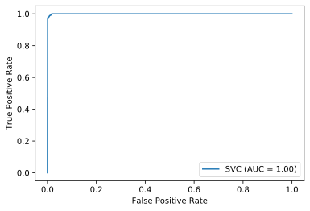
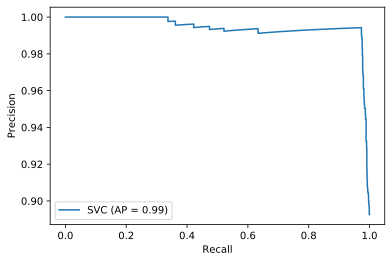

## Setup


```python
import numpy as np 
import pandas as pd 
import seaborn as sns 
import matplotlib.pyplot as plt 
```


```python
data = pd.read_csv("./train.csv", sep=",", encoding="utf8" )
test_data = pd.read_csv("./test.csv", sep=",", encoding="utf8" )
```

## EDA


```python
correlation = data.corr(method='spearman')['IN_TREINEIRO']
corr_dict = correlation.to_dict()

# Get feature correlation for correlation minimum threshold
threshold = 0.1
[index for index, value in corr_dict.items() if value > threshold or value < - threshold]
```


    ['NU_IDADE',
     'TP_ESTADO_CIVIL',
     'TP_ST_CONCLUSAO',
     'TP_ANO_CONCLUIU',
     'TP_ESCOLA',
     'IN_TREINEIRO',
     'IN_CERTIFICADO',
     'Q030']


```python
data.NU_IDADE.unique()
```


    array([24, 17, 21, 25, 28, 18, 16, 29, 27, 19, 20, 30, 22, 15, 40, 23, 37,
           32, 38, 26, 42, 44, 34, 48, 31, 52, 43, 36, 45, 39, 57, 33, 49, 35,
           47, 46, 14, 51, 59, 56, 50, 41, 65, 55, 54, 53, 62, 63, 67, 61, 60,
           64, 58, 66, 13])


```python
data[data["IN_TREINEIRO"] == 1].groupby("NU_IDADE").NU_IDADE.sum()
```


    NU_IDADE
    13       13
    14      196
    15     4020
    16    13776
    17    10166
    18      738
    Name: NU_IDADE, dtype: int64


```python
validation = test_data.copy()
val_columns = validation.columns.tolist()

df = data[val_columns]
df["IN_TREINEIRO"] = data["IN_TREINEIRO"]
df = df.drop(columns=["CO_UF_RESIDENCIA", "NU_INSCRICAO"])
df = df.drop([  429,   914,  1280,  1775,  5124,  6253,  7126,  7656, 12475], axis=0)

na_percentage = df.isna().sum() / len(df)
pd.DataFrame(na_percentage[na_percentage.map(lambda x: x > 0)], columns=["NA_RATE"])
```


<div>
<style scoped>
    .dataframe tbody tr th:only-of-type {
        vertical-align: middle;
    }

    .dataframe tbody tr th {
        vertical-align: top;
    }

    .dataframe thead th {
        text-align: right;
    }
</style>
<table border="1" class="dataframe">
  <thead>
    <tr style="text-align: right;">
      <th></th>
      <th>NA_RATE</th>
    </tr>
  </thead>
  <tbody>
    <tr>
      <th>TP_ENSINO</th>
      <td>0.688361</td>
    </tr>
    <tr>
      <th>TP_DEPENDENCIA_ADM_ESC</th>
      <td>0.688361</td>
    </tr>
    <tr>
      <th>NU_NOTA_CN</th>
      <td>0.246338</td>
    </tr>
    <tr>
      <th>NU_NOTA_CH</th>
      <td>0.246338</td>
    </tr>
    <tr>
      <th>NU_NOTA_LC</th>
      <td>0.261788</td>
    </tr>
    <tr>
      <th>TP_STATUS_REDACAO</th>
      <td>0.261788</td>
    </tr>
    <tr>
      <th>NU_NOTA_COMP1</th>
      <td>0.261788</td>
    </tr>
    <tr>
      <th>NU_NOTA_COMP2</th>
      <td>0.261788</td>
    </tr>
    <tr>
      <th>NU_NOTA_COMP3</th>
      <td>0.261788</td>
    </tr>
    <tr>
      <th>NU_NOTA_COMP4</th>
      <td>0.261788</td>
    </tr>
    <tr>
      <th>NU_NOTA_COMP5</th>
      <td>0.261788</td>
    </tr>
    <tr>
      <th>NU_NOTA_REDACAO</th>
      <td>0.261788</td>
    </tr>
    <tr>
      <th>Q027</th>
      <td>0.536914</td>
    </tr>
  </tbody>
</table>
</div>


## Preprocessing


```python
X = df.drop('IN_TREINEIRO', axis=1)
y = df['IN_TREINEIRO']

# Since NA imputation method doesn't leak data from test set, the imputation will be done before the data is split

X.fillna(-1, inplace=True)

# Validation process mirror test preprocessing

validation = test_data.copy()
validation = validation.drop(columns=["CO_UF_RESIDENCIA", "NU_INSCRICAO"])
validation.fillna(-1, inplace=True)
```

### Feature Selection


```python
categoric = X.columns[X.columns.str.match("^(TP_|SG_|Q0)")].tolist()
features = X.columns[X.columns.str.match("^(TP_|SG_|Q0|NU_IDADE|IN_CONCLUSAO)")].tolist()

X = X[features]
X = pd.get_dummies(X, columns=categoric, drop_first=True)
X.shape
```


    (13721, 130)


```python
tidyval = validation[features]
tidyval = pd.get_dummies(tidyval, columns=categoric, drop_first=True)
tidyval.shape
```


    (4570, 130)


## Data Splitting


```python
from sklearn.model_selection import train_test_split


X_train, X_test, y_train, y_test = train_test_split(X,y, train_size=0.3, random_state=0)
X_train.shape, X_test.shape, y_train.shape, y_test.shape 
```


    ((4116, 130), (9605, 130), (4116,), (9605,))


## Treat Imbalanced Data


```python
treineiros = pd.DataFrame({"sum_treineiro": y_train.value_counts()})
treineiros.index = ["NAO", "SIM"]
treineiros
```


<div>
<style scoped>
    .dataframe tbody tr th:only-of-type {
        vertical-align: middle;
    }

    .dataframe tbody tr th {
        vertical-align: top;
    }

    .dataframe thead th {
        text-align: right;
    }
</style>
<table border="1" class="dataframe">
  <thead>
    <tr style="text-align: right;">
      <th></th>
      <th>sum_treineiro</th>
    </tr>
  </thead>
  <tbody>
    <tr>
      <th>NAO</th>
      <td>3573</td>
    </tr>
    <tr>
      <th>SIM</th>
      <td>543</td>
    </tr>
  </tbody>
</table>
</div>


```python
from imblearn.under_sampling import RandomUnderSampler


rus = RandomUnderSampler(random_state=0)

X_res, y_res = rus.fit_resample(X_train, y_train)
treineiros_res = pd.DataFrame({"sum_treineiro": y_res.value_counts()})
treineiros_res.index = ["NAO", "SIM"]
treineiros_res
```


<div>
<style scoped>
    .dataframe tbody tr th:only-of-type {
        vertical-align: middle;
    }

    .dataframe tbody tr th {
        vertical-align: top;
    }

    .dataframe thead th {
        text-align: right;
    }
</style>
<table border="1" class="dataframe">
  <thead>
    <tr style="text-align: right;">
      <th></th>
      <th>sum_treineiro</th>
    </tr>
  </thead>
  <tbody>
    <tr>
      <th>NAO</th>
      <td>543</td>
    </tr>
    <tr>
      <th>SIM</th>
      <td>543</td>
    </tr>
  </tbody>
</table>
</div>


## Model Training


```python
from sklearn.metrics import classification_report, plot_roc_curve, accuracy_score, plot_precision_recall_curve
from sklearn.svm import SVC


model = SVC(C=1, kernel='rbf', degree=3, gamma='auto', class_weight='balanced', max_iter=-1, random_state=0)

model.fit(X_res, y_res)
prediction = model.predict(X_test)
```

## Model Testing


```python
print(f'Model accuracy: {accuracy_score(y_test, prediction) * 100:.2f}%')
print(classification_report(y_test, prediction))
```

    Model accuracy: 98.31%
                  precision    recall  f1-score   support
    
               0       1.00      0.98      0.99      8366
               1       0.88      1.00      0.94      1239
    
        accuracy                           0.98      9605
       macro avg       0.94      0.99      0.96      9605
    weighted avg       0.99      0.98      0.98      9605
    


```python
plot_roc_curve(model, X_test, y_test);
```





```python
plot_precision_recall_curve(model, X_test, y_test);
```





## Validation


```python
prediction = model.predict(tidyval)
```


```python
answer = pd.DataFrame({
    "NU_INSCRICAO": test_data["NU_INSCRICAO"],
    "IN_TREINEIRO": prediction
})

answer.to_csv("./answer.csv", sep=",", encoding="utf8", index=False)
```


```python
! codenation submit -c enem-4 
```

    Versão: 1.0.14
    
    Usando arquivo de configuração: /home/vcwild/.codenation.yml
    
    Executando testes...
    
    {"score": 98.57768052516411}
    Preparando code review... 100% |████████████████████████████████████████|  [6s:0s]
    Códigos submetidos com sucesso! 
    
    
    Ops! Calma aí!
    
    Você precisa esperar 1 minuto entre cada submissão.
    Respire, pegue um café e envie novamente daqui a alguns segundos
    
